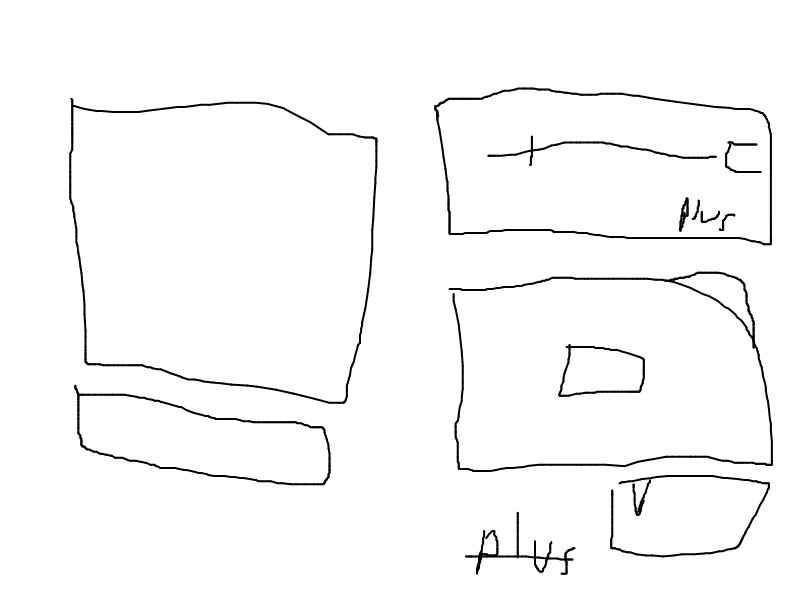
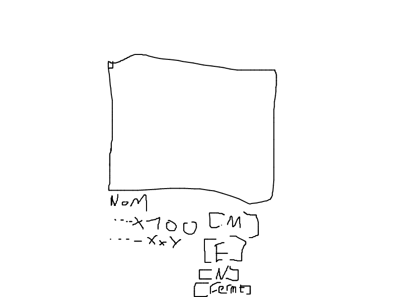

# AgrandisseurImage

## Description

AgrandisseurImage est une application Python conçue pour agrandir des images avec un multiplicateur personnalisé. L'application utilise l'architecture MVC (Modèle-Vue-Contrôleur) pour une structure modulaire et maintenable.

### Fonctionnalités principales
- **Sélection d'image** : Choix d'une image via file dialog
- **Agrandissement** : Multiplicateur de 1 à 100 via slider
- **Prévisualisation** : Affichage de l'image agrandie en temps réel
- **Enregistrement** : Sauvegarde de l'image traitée

## Installation

### Option 1 : Utiliser l'installateur
1. Exécuter le fichier d'installation :
   ```
   installation/AgrandisseurImageInstallateur/AgrandisseurImage.exe
   ```

### Option 2 : Exécution manuelle
1. S'assurer que Python 3.x est installé
2. Installer les dépendances :
   ```bash
   pip install pillow
   ```

## Lancement du projet

### Méthode recommandée
```bash
cd Source/
python AgrandisseurImage.py
```

### Alternative
Exécuter directement depuis la racine du projet :
```bash
python Source/AgrandisseurImage.py
```

## Utilisation

1. **Lancer l'application** : L'interface principale s'affiche
2. **Sélectionner une image** : Cliquer sur "choisir une image" et sélectionner un fichier
3. **Ajuster le multiplicateur** : Utiliser le slider (1-100) ou entrer une valeur directement
4. **Prévisualiser** : L'image agrandie s'affiche automatiquement
5. **Enregistrer** : Cliquer sur le bouton d'enregistrement pour sauvegarder le résultat

## Structure du projet

```
AgrandisseurImage/
├── Source/
│   ├── AgrandisseurImage.py (point d'entrée principal)
│   ├── assets/ (icônes et images par défaut)
│   ├── Controleur/ (gestionnaires d'événements)
│   ├── Model/ (logique métier)
│   └── View/ (interface graphique)
├── installation/ (fichiers d'installation)
├── shema/ (schémas de l'application)
└── README.md (ce fichier)
```

## Dépendances

- **Python 3.x** : Langage de programmation
- **Pillow (PIL)** : Bibliothèque de traitement d'images
- **tkinter** : Bibliothèque d'interface graphique (intégrée à Python)

## Schémas

### Interface principale


### Processus de validation


## Architecture MVC

### Modèle (Model)
- `Source/Model/fonctionAgrendisement.py` : Algorithme d'agrandissement
- `Source/Model/ModelEnregistrement.py` : Gestion de l'enregistrement

### Vue (View)
- `Source/View/MainView.py` : Fenêtre principale
- `Source/View/ParametrageView.py` : Interface de paramétrage
- `Source/View/Componsent/Slider.py` : Composant slider personnalisé

### Contrôleur (Controller)
- `Source/Controleur/EcouteurSelectionImage.py` : Gestion de la sélection d'image
- `Source/Controleur/EcouteurActialiserImage.py` : Rafraîchissement de l'image
- `Source/Controleur/EcouteurValider.py` : Validation et enregistrement

## Algorithme d'agrandissement

L'algorithme utilise une approche par duplication de pixels :
1. Pour chaque pixel de l'image originale
2. Dupliquer le pixel selon le multiplicateur
3. Remplir la zone correspondante dans la nouvelle image

Cet algorithme simple garantit une qualité d'image parfaite mais peut être lent pour les grandes images ou multiplicateurs élevés.

## Notes

- L'application est conçue pour fonctionner sur Windows
- Les images de grande taille peuvent nécessiter plus de mémoire
- Le multiplicateur maximum est limité à 100 pour des raisons de performance